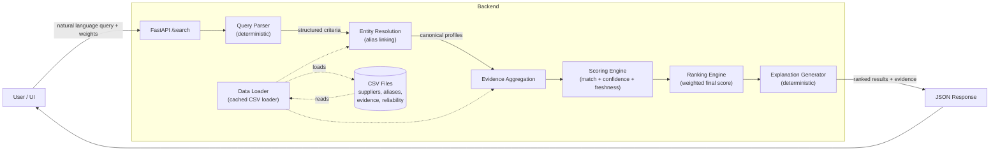
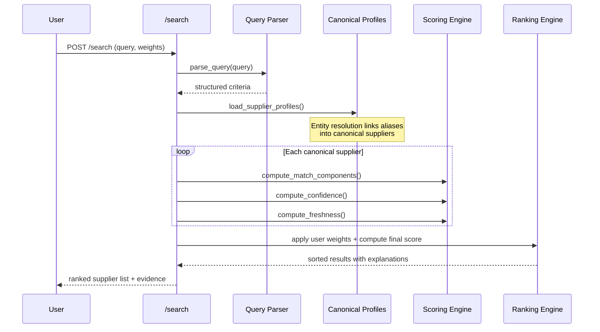
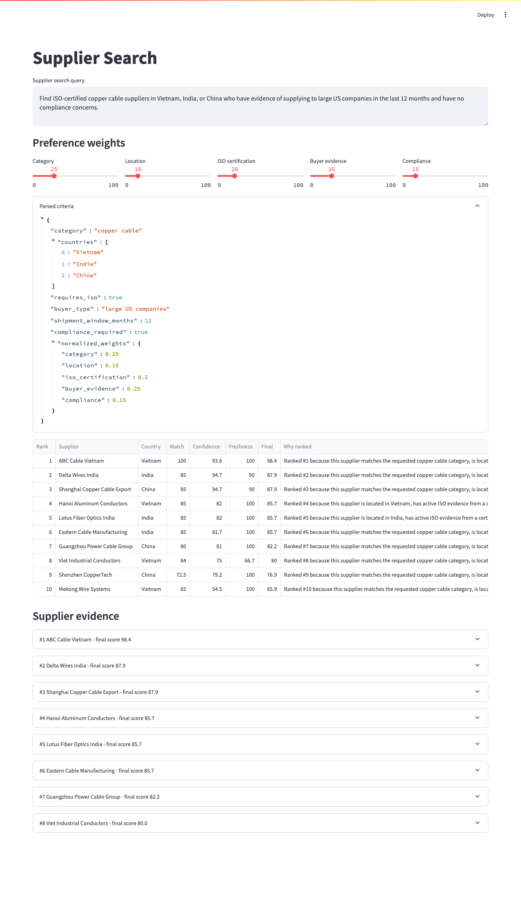
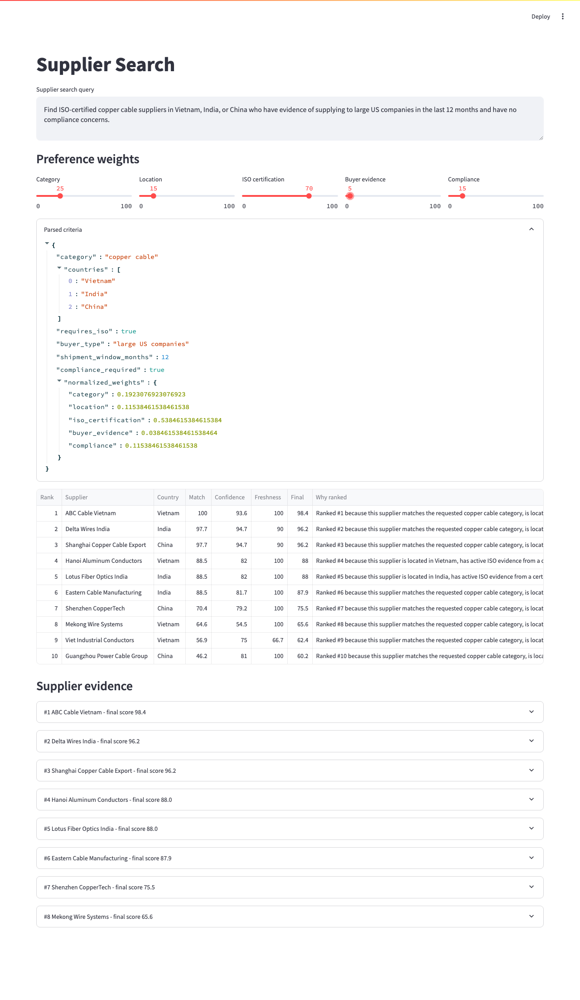

# Supplier Search

Evidence-backed supplier search prototype that converts a natural language procurement request into structured criteria, resolves noisy supplier records into canonical profiles, scores evidence confidence separately from business relevance, and returns ranked supplier recommendations with explanations.

---

## Problem

Procurement teams searching for suppliers face three challenges:
1. **Noisy data** — the same supplier appears under different names across trade databases, certification registries, and company websites.
2. **Untrusted claims** — suppliers self-report ISO certifications and customer references without verification.
3. **Opaque rankings** — search engines return results without explaining *why* a supplier is recommended or what evidence supports the claim.

This prototype demonstrates a clean separation between **business relevance** (does this supplier match what I asked for?) and **evidence confidence** (how much should I trust this claim?), with fully transparent, explainable rankings.

> **No LLM is used for ranking or trust decisions.** Query parsing, entity resolution, scoring, ranking, compliance handling, and explanation generation are all deterministic and auditable. An LLM could optionally be added for richer natural language parsing, but the core trust system would remain deterministic.

---

## Architecture



**Query flow**: natural language → parsed criteria → supplier matching → evidence scoring → weighted ranking → human-readable explanation.

---

## Data Flow



---

## Dataset

The mock dataset contains **12 supplier records** across Vietnam, India, and China with intentionally noisy data:

| Supplier | Country | Category | ISO | Buyer Evidence | Compliance | Notes |
|---|---|---|---|---|---|---|
| ABC Cable Vietnam | Vietnam | copper cable | ✅ cert DB | ✅ recent GM shipment | ✅ clean | Strongest match |
| Delta Wires India | India | copper cable | ✅ cert DB | 🟡 older Boeing shipment | ✅ clean | Stale buyer evidence |
| Shenzhen CopperTech | China | copper cable | ⚠️ website only | ⚠️ self-claimed | ✅ clean | Low-confidence ISO |
| Viet Industrial Conductors | Vietnam | copper cable | ❌ expired | ✅ recent Caterpillar | ✅ clean | Expired ISO |
| Eastern Cable Manufacturing | India | copper cable | ✅ cert DB | ✅ recent Honeywell | ❌ customs concern | Compliance flag |
| Guangzhou Power Cable Group | China | copper cable | ❌ missing | ✅ recent Tesla | ✅ clean | Missing ISO |
| Mekong Wire Systems | Vietnam | copper cable | ⚠️ website only | ⚠️ website claims | ✅ clean | Low confidence |
| Shanghai Copper Cable Export | China | copper cable | ✅ cert DB | 🟡 older GE shipment | ✅ clean | Stale buyer evidence |
| Lotus Fiber Optics India | India | fiber optic | ✅ cert DB | ✅ recent Verizon | ✅ clean | Wrong category |
| Hanoi Aluminum Conductors | Vietnam | aluminum | ✅ cert DB | ✅ recent US utility | ✅ clean | Wrong category |

**Key data characteristics**: duplicate names (ABC Cable appears as 3 variants), expired certifications, stale shipment evidence, website-only claims, compliance flags, and mixed-quality evidence sources.

---

## Project Structure

```
backend/
  app/
    __init__.py
    main.py              FastAPI application (3 endpoints)
    config.py            Constants, weights, paths, as-of date
    models.py            Dataclasses for domain objects
    schemas.py           Pydantic request/response models
    query_parser.py      Deterministic NL → structured criteria
    entity_resolution.py Name normalization, alias linking, candidate matching
    data_loader.py       CSV loading with LRU cache, profile assembly
    scoring.py           Match, confidence, and freshness scoring
    ranking.py           Weighted final score, sorting
    explanations.py      Human-readable rank explanations and evidence summaries
  data/
    suppliers.csv        12 supplier records
    supplier_aliases.csv 11 alias mappings
    evidence.csv         28 evidence records
    source_reliability.csv   6 source types with trust scores
  tests/
    test_api.py
    test_query_parser.py
    test_entity_resolution.py
    test_scoring.py
    test_ranking.py
  requirements.txt
frontend/
  streamlit_app.py       Streamlit UI with weight sliders and detail view
docs/
  technical_note.md      One-page architecture and scoring rationale
  api.md                 API reference
  assumptions.md         Scope, limitations, production extension notes
README.md
```

---

## Scoring Model

### Match Score (business relevance)

Each criterion is scored 0–1 based on evidence:

| Criterion | 1.0 | 0.7 | 0.5 | 0.2–0.4 | 0.0 |
|---|---|---|---|---|---|
| Category | Exact match | Related cable | — | — | No match |
| Location | In requested countries | — | No countries specified | — | Outside requested |
| ISO certification | Active, cert database | — | Website-only claim | Expired (0.2) | No evidence |
| Buyer evidence | Recent shipment (≤12mo) | — | Website claim | Old shipment (0.4) | No evidence |
| Compliance | No flags (database) | — | Unknown status | — | Active flag |

```text
weighted_match = Σ(criterion_weight × criterion_score)
```

Default weights: category 25%, location 15%, ISO 20%, buyer evidence 25%, compliance 15%.  
Weights are normalized if they don't sum to 1.0. All-zero weights fall back to defaults.

### Confidence Score (evidence trust)

```text
confidence = 0.40 × source_reliability
           + 0.25 × cross_source_confirmation
           + 0.20 × evidence_freshness
           + 0.15 × contradiction_penalty
```

- **Source reliability**: certification databases (0.95), trade databases (0.90), compliance databases (0.90), financial databases (0.85), company websites (0.55), generic web (0.40).
- **Cross-source confirmation**: 1.0 if 3+ independent sources, 0.7 if 2 sources, 0.4 if 1 trusted source, 0.2 if website-only.
- **Freshness**: 1.0 if ≤12 months, 0.7 if ≤24 months, 0.4 if older, 0.0 if expired.
- **Contradiction**: 1.0 if no contradictions, 0.5 if missing evidence, 0.0 if contradictory evidence.

### Final Score

```text
final_score = 0.65 × weighted_match + 0.25 × confidence + 0.10 × freshness_modifier
```

Scores are normalized to a 0–100 display scale. The separation between match and confidence means a supplier can be **highly relevant but weakly verified** (good product fit, website-only evidence) or **highly verified but less relevant**.

---

## API Reference

### `GET /health`

```bash
curl http://127.0.0.1:8000/health
```

```json
{"status": "ok"}
```

### `POST /search`

```bash
curl -X POST http://127.0.0.1:8000/search \
  -H "Content-Type: application/json" \
  -d '{
    "query": "Find ISO-certified copper cable suppliers in Vietnam, India, or China who have evidence of supplying to large US companies in the last 12 months and have no compliance concerns.",
    "weights": {
      "category": 0.25,
      "location": 0.15,
      "iso_certification": 0.20,
      "buyer_evidence": 0.25,
      "compliance": 0.15
    }
  }'
```

**Response**:

```json
{
  "status": "ok",
  "parsed_query": {
    "category": "copper cable",
    "countries": ["Vietnam", "India", "China"],
    "requires_iso": true,
    "buyer_type": "large US companies",
    "shipment_window_months": 12,
    "compliance_required": true
  },
  "normalized_weights": {
    "category": 0.25, "location": 0.15, "iso_certification": 0.2,
    "buyer_evidence": 0.25, "compliance": 0.15
  },
  "results": [
    {
      "rank": 1,
      "supplier_id": "sup_001",
      "supplier_name": "ABC Cable Vietnam",
      "country": "Vietnam",
      "match_score": 100.0,
      "confidence_score": 88.0,
      "freshness_score": 100.0,
      "final_score": 95.5,
      "matched_criteria": {
        "category": 1.0, "location": 1.0, "iso_certification": 1.0,
        "buyer_evidence": 1.0, "compliance": 1.0
      },
      "explanation": "Ranked #1 because this supplier matches the requested copper cable category, is located in Vietnam, has active ISO evidence from a certification database, has recent trade evidence to a large US buyer, has no compliance flags in the compliance database.",
      "evidence": [
        {
          "claim": "ISO 9001 active",
          "source": "Mock ISO Registry",
          "source_type": "certification_database",
          "source_reliability": 0.95,
          "confidence": "high",
          "timestamp": "2026-02-10",
          "notes": "Active ISO 9001 certification found in certification database."
        }
      ],
      "weaknesses": []
    }
  ]
}
```

**Edge cases**:

| Scenario | `status` field | Behavior |
|---|---|---|
| Missing category or countries | `needs_clarification` | Partial results returned with `suggested_clarifications` |
| No suppliers match | `no_results` | `fallback_suggestions` provided |
| Invalid/zero weights | — | Normalized to defaults |

### `GET /suppliers/{supplier_id}`

Returns the full supplier profile including all aliases, linked records, entity resolution details, and complete evidence history.

---

## Setup

```bash
# Clone and enter
cd supplier-search

# Create virtual environment
python3 -m venv .venv
source .venv/bin/activate

# Install dependencies
pip install -r backend/requirements.txt
```

## Run API

```bash
PYTHONPATH=backend uvicorn app.main:app --reload --host 127.0.0.1 --port 8000
```

| Endpoint | Description |
|---|---|
| `http://127.0.0.1:8000/docs` | Interactive API docs (Swagger) |
| `http://127.0.0.1:8000/health` | Health check |
| `http://127.0.0.1:8000/search` | `POST` — search suppliers |

## Run UI

```bash
streamlit run frontend/streamlit_app.py
```

Adjust the weight sliders and re-run to see ranking change in real time.

## Run Tests

```bash
PYTHONPATH=backend pytest backend/tests -v
```

21 tests covering query parsing, entity resolution, scoring, ranking, and API response shape.

---

## Demo Walkthrough

1. **Start the API** and **UI** (see commands above).
2. Enter the default query in the Streamlit text area.
3. Observe the **parsed criteria** — the system extracts category, countries, ISO requirement, buyer type, shipment window, and compliance flag from natural language.
4. View the **ranked results** — note ABC Cable Vietnam at #1 with full scores across all criteria.
5. Click on each supplier to inspect **evidence records**, **source reliability**, **entity resolution aliases**, and **weaknesses**.
6. Adjust the **weight sliders** — increase "ISO certification" to 60 and re-run. Watch Guangzhou Power Cable Group (missing ISO) drop in rank.
7. Open the **supplier detail** page via `/suppliers/{supplier_id}` to see all linked aliases and evidence.
8. Note that **entity resolution is simplified for the prototype** — canonical names are pre-seeded, and the system links aliases via these labels rather than performing unsupervised clustering. Candidate matches across unrelated records are surfaced but never silently merged, and production would require stronger identifiers (tax IDs, registration IDs) and human review.





---

## Key Engineering Decisions

| Decision | Rationale |
|---|---|
| **Deterministic scoring** | Ranking, confidence, compliance, ISO validity, and freshness are all deterministic — auditable and testable without model drift. |
| **Confidence separated from relevance** | A supplier can be a perfect product match but have weak evidence (website-only claims). The two scores never mix. |
| **Evidence stored with provenance** | Every claim includes `source_type`, `source_reliability`, `evidence_date`, and `notes`. No flat `iso_certified: true` fields. |
| **Source reliability in one file** | `source_reliability.csv` is the single source of truth for trust scores, loaded and applied during evidence ingestion. |
| **Entity resolution is simplified** | Canonical names are pre-seeded in the CSV for the prototype; the system links aliases via these labels and surfaces candidate matches across unrelated records but never silently merges. Production would require tax IDs, registration IDs, and human review for medium-confidence merges. |
| **No LLM required** | Query parsing uses regex patterns. LLMs could be added for richer parsing but never for ranking or trust decisions. |

---

## Design Boundary

LLMs are intentionally not required. Query parsing is deterministic; ranking, confidence scoring, ISO validity, compliance handling, freshness, and entity resolution are all deterministic and auditable. A production version could add an LLM parser with Pydantic JSON validation and fallback to the deterministic parser, but the core trust system remains deterministic.

---

## Production Scaling Notes

| Component | Current (prototype) | Production |
|---|---|---|
| Data storage | CSV files | Postgres (canonical entities + evidence) + S3/GCS (raw source snapshots) |
| Search | In-memory iteration | OpenSearch/Elasticsearch (faceted) + pgvector (semantic) |
| Entity resolution | Canonical labels + name similarity | Tax IDs, registration IDs, DUNS, domain, address — with human-in-the-loop |
| Data updates | Re-process CSVs | Kafka/SQS/Celery for async ingestion and enrichment |
| Source reliability | Static CSV | Configurable per customer, tuned from review feedback |
| Supplier relationships | None | Neo4j for parent/subsidiary and buyer-supplier graph |
| LLM usage | None | NL query parsing only, with schema validation and deterministic fallback |
| Observability | None | OpenTelemetry traces for scoring decisions

